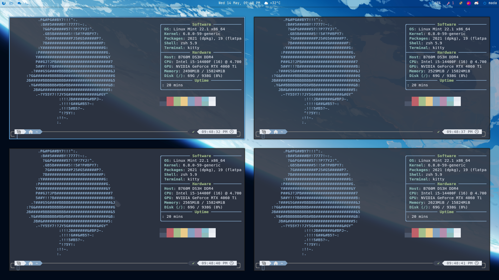
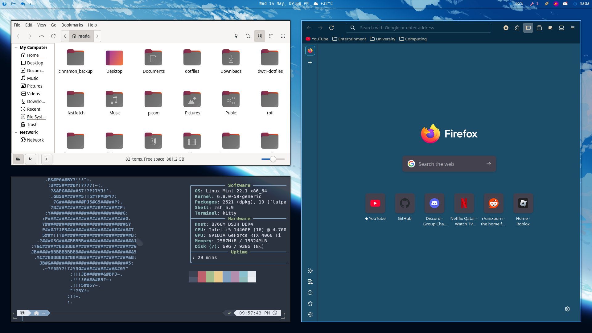

# 🧩 My Dotfiles – BSPWM + Polybar Setup (Linux Mint OS)

A clean, keyboard-driven BSPWM setup with Polybar, Kitty, and a beautiful tiling workflow. Built for speed, minimalism, and full control over the desktop experience.




---

## 🚀 Features

- ⚙️ **BSPWM** – Lightweight, fast tiling window manager
- 📟 **Polybar** – Clean, customizable status bar
- 💡 **SXHKD** – Powerful keybindings
- 🖼 **Feh** / **Nitrogen** – Wallpaper support
- 🐚 **ZSH** – With plugins and Nerd Font support
- 🧱 **Kitty** – GPU-accelerated terminal
- 🎨 **JetBrains Mono Nerd Font** – For beautiful glyphs/icons

---

## 🛠 Directory Structure

~/.config/
├── bspwm/
│ ├── bspwmrc
├── sxhkd/
│ ├── sxhkdrc
├── polybar/
│ ├── config.ini
│ ├── launch.sh
├── kitty/
├── zsh/
│ ├── .zshrc


---

## ⌨️ Keybindings

| Shortcut       | Action                    |
|----------------|---------------------------|
| `Super + Enter`| Launch terminal (Kitty)   |
| `Super + Q`    | Close window              |
| `Super + Space`| Toggle floating mode      |
| `Super + {h,j,k,l}` | Move focus           |
| `Super + Shift + {h,j,k,l}` | Move window  |
| `Super + R`    | Rofi launcher             |

> Customize all shortcuts in `~/.config/sxhkd/sxhkdrc`

---

## 🧠 Requirements

- `bspwm`
- `sxhkd`
- `polybar`
- `kitty`
- `feh` or `nitrogen`
- `rofi`
- `zsh`
- `nerd-fonts` (JetBrains Mono recommended)

sudo apt install bspwm sxhkd polybar kitty rofi feh zsh fonts-jetbrains-mono
  

---

## 📦 Installation

1. Clone this repo:
```
git clone https://github.com/lightning-fast/dotfiles-bspwm.git ~/dotfiles
```

2. Copy configs into ~/.config:
```bash
cp -r ~/dotfiles/bspwm ~/.config/
cp -r ~/dotfiles/sxhkd ~/.config/
cp -r ~/dotfiles/polybar ~/.config/
# etc.
```

3. Make sure scripts are executable
```
chmod +x ~/.config/bspwm/bspwmrc
chmod +x ~/.config/polybar/launch.sh
```

4. Install required packages and reboot your session


